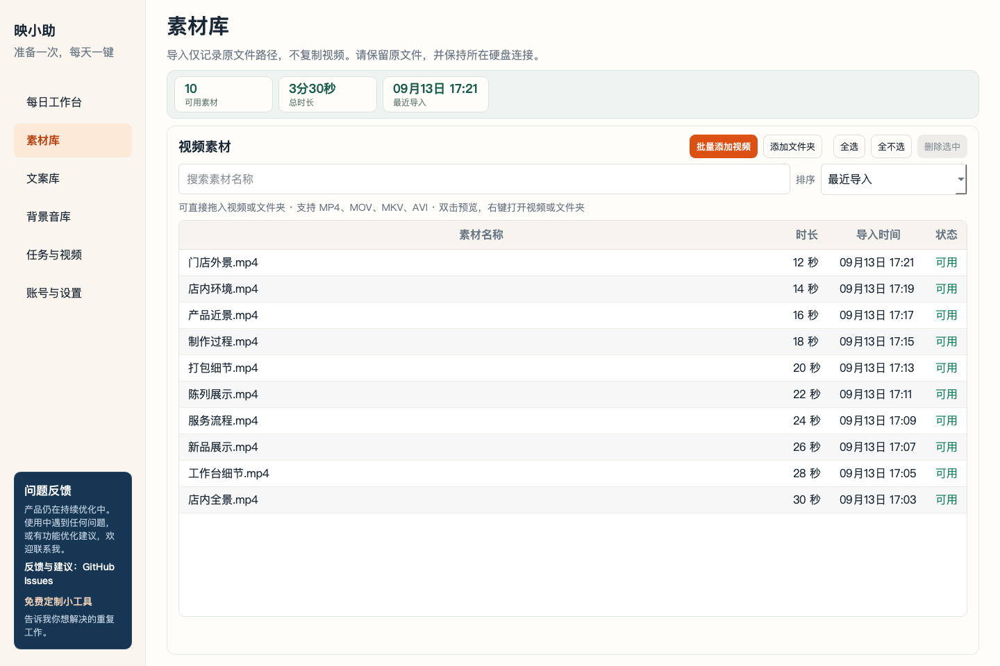
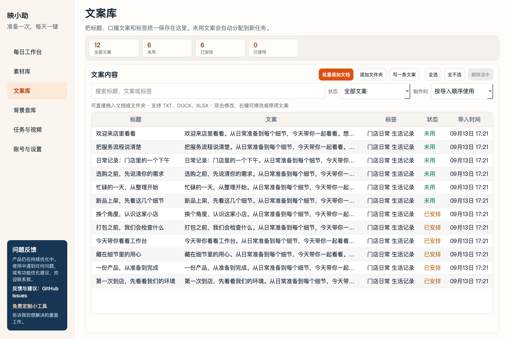
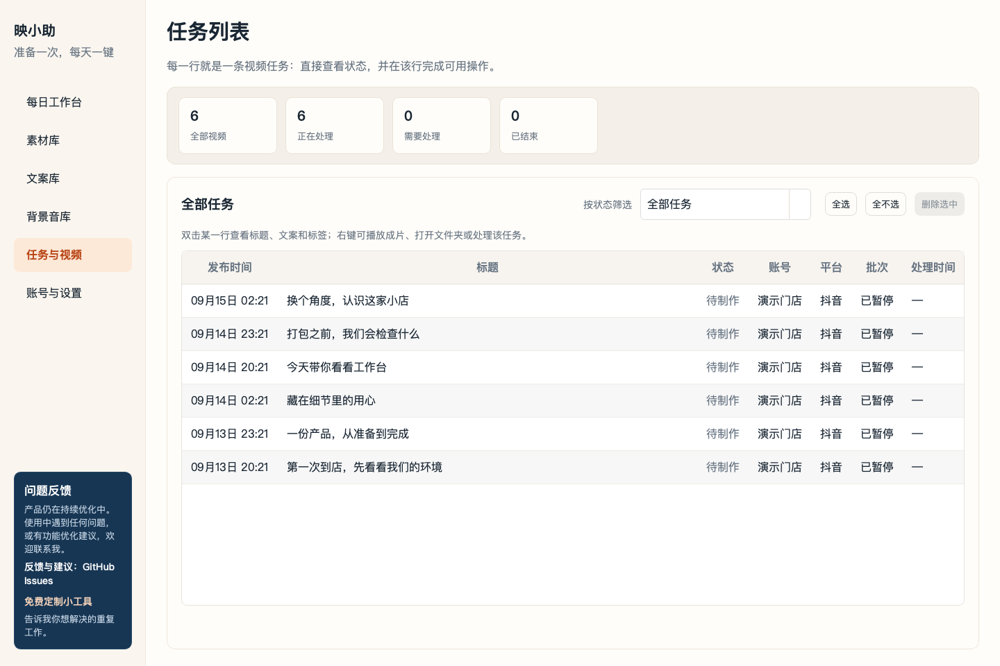

# 映小助 VideoFlow

**导入素材和文案，把混剪、配音、字幕和抖音发布串成一条流程。**

面向商家和内容创作者的短视频自动化桌面工具。本仓库提供入门版源码，无试用期限或激活要求；不包含多账号、多平台、AI文案和模型配音等进阶功能。

## 界面预览

下面是开源版程序的真实界面，使用独立演示数据。账号名称、素材信息和排期均为示例，未登录真实账号、未执行制作或发布。不同系统的字体与控件外观可能略有差异。

### 每日工作台

登录账号、导入素材和文案后，在这里选择制作数量、即时或定时发布、发布间隔。


### 素材库

通过“添加文件夹”批量导入视频，按名称搜索或排序；素材引用原文件，减少重复占用磁盘。



### 文案库

管理标题、口播和发布文案，选择顺序或随机使用；导入窗口提供中文模板。



### 任务列表

集中查看每条视频的计划时间和处理状态。双击查看标题、文案和标签，右键操作任务或打开成片文件夹。



## 功能

- 本地素材混剪，支持近期镜头避让。
- 批量导入文案，按顺序或随机选用。
- 系统中文配音，字幕字体、颜色、大小和每行字数设置。
- 背景音乐随机、顺序或指定选用。
- 单账号抖音即时、定时与间隔发布。
- 任务状态、成片预览与异常处理。
- 视频和背景音乐引用原文件，减少重复复制。

## 从源码运行

建议使用 Python 3.11。主要面向 Windows；macOS 可用于开发及本地运行。Linux 的系统配音未作为交付能力验证。

先安装 FFmpeg（含 ffprobe）并加入 PATH，同时安装 Chrome 或 Edge。Windows 需要可用的中文系统声音和中文字体。

```bash
git clone https://github.com/tianyiswl/yingxiaozhu.git
cd yingxiaozhu
python -m venv .venv
```

Windows PowerShell：

```powershell
.venv\Scripts\python.exe -m pip install -r requirements.txt
.venv\Scripts\python.exe app.py
```

macOS：

```bash
.venv/bin/python -m pip install -r requirements.txt
.venv/bin/python app.py
```

运行目录需要可写。默认在程序旁保存 data、outputs、temp、logs；也可通过设置选择目录。不要提交这些运行数据或浏览器资料。

## 使用流程

1. 登录抖音账号：在官方窗口完成扫码或验证码。
2. 在素材库选择“添加文件夹”，导入视频素材。
3. 在文案库导入文档，可先从导入窗口下载模板。
4. 设置配音、字幕和背景音乐。
5. 选择制作数量、即时或定时发布以及间隔，点击一键制作并安排发布。

本机等待的任务需要电脑保持运行。平台定时支持范围内的任务会尝试提交至平台定时；提交结果不明时请先核对，不要反复创建相同任务。

## 开发与验证

```bash
python -c "from pathlib import Path; Path('.tmp').mkdir(exist_ok=True)"
python -m unittest discover -s tests
```

真实浏览器、媒体渲染和界面测试需显式启用，默认跳过不代表通过。自动测试不替代用户电脑和真实账号验收。页面变化可能导致自动化失效。

当前混剪不保证画面与每句话语义匹配；字幕时间由口播比例估算。本项目不保证内容流量或经营效果。

## 参与

欢迎在 Issues 提交复现步骤、系统版本和脱敏日志，或通过 Pull Request 贡献改进。请勿上传账号登录资料、Cookie、验证码或未获授权的素材。

## 许可

项目源代码采用 [MIT License](LICENSE)，允许修改、商用和再分发，须保留版权及许可声明；第三方依赖保留各自许可。详见 [第三方说明](THIRD_PARTY_NOTICES.md)。
